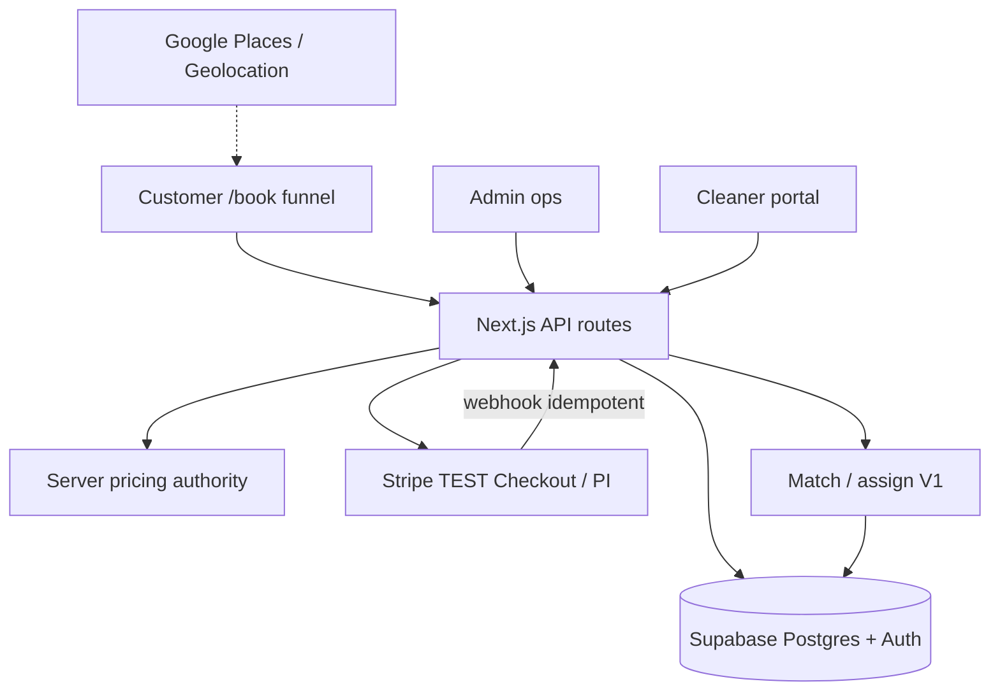

# MaidLinx architecture (company board)

**Rule:** No secrets. This is the product/system map for agents — not a rewrite brief.  
**Stack:** Next.js App Router · TypeScript · Supabase (Auth/RLS/Storage) · Stripe Checkout + webhooks · Tailwind  
**Detail docs:** `README.md`, `MVP.md`, `SETUP_TODAY.md`, `docs/MARKETPLACE.md`, `docs/ALGORITHMS.md`, `docs/MATCHING.md`

---

## Core loop (must not break)

```text
BOOK → PAY → ASSIGN → CLEAN → COMPLETE → REBOOK
```

Canonical booking statuses (`src/lib/bookings/status.ts`):

`pending_payment` → (`awaiting_assignment` | `confirmed`) → `offered` / `assigned` / `accepted` → `on_the_way` → `arrived` → `in_progress` → `completed` | `cancelled`

Payment confirmation moves paid bookings to `awaiting_assignment` with `payment_status: deposit_paid`.

---

## System context



---

## Layers

| Layer | Responsibility | Key paths |
|-------|----------------|-----------|
| Marketing / entry | Homepage, earn, for-business | `src/app/(marketing)/`, `src/app/page.tsx` |
| Booking funnel | One decision per screen | `src/app/(marketing)/book/*`, `src/lib/bookings/booking-routes.ts`, `src/components/booking/` |
| Platform apps | Customer / cleaner / admin shells | `src/app/(platform)/` |
| API | Create booking, quote, checkout, webhooks, admin, cleaner | `src/app/api/` |
| Domain | Pricing, markets, matching, availability, bookings repo | `src/lib/{pricing,markets,matching,availability,bookings}/` |
| Data | Supabase schema + RLS | `supabase/migrations/`, remote project **Maidlinx** (`pgoyhujsfbmfshtnlbnx`) |
| Payments | Stripe server + webhook claim table | `src/lib/stripe/`, `src/lib/payments/`, `src/app/api/webhooks/stripe/` |

---

## Critical path (runtime)

1. **Address** — Places autocomplete + current location (manual fallback). Market/zone via `resolveMarket` / `resolveMarketOrThrow`.
2. **Property → details → service → add-ons → date → time → access → review** — screen guards in `booking-routes.ts`.
3. **Quote** — `POST /api/bookings/quote` → `calculateBookingPrice` (server).
4. **Create** — `POST /api/bookings` → recalculate + `assertPriceMatch` → `insertBooking` via **service-role** admin client (`src/lib/supabase/admin.ts`). Status `pending_payment`.
5. **Pay** — `POST /api/bookings/[id]/checkout` creates/reuses PaymentIntent; client Elements; webhook + `confirm-payment` fallback.
6. **Confirm** — webhook event claimed in `stripe_webhook_events` → booking `awaiting_assignment` / deposit paid.
7. **Assign** — admin match scores + assign/offer (`src/lib/matching/assignment.ts`).
8. **Clean** — cleaner job transitions (`on_the_way` → `arrived` → `in_progress` → `completed`).
9. **Rebook** — “Book again” CTAs (not yet one-tap productized).

---

## Auth & secrets boundaries

| Concern | Rule |
|---------|------|
| Browser | Anon key + publishable Stripe/Maps only (`NEXT_PUBLIC_*`) |
| Server booking write | `SUPABASE_SERVICE_ROLE_KEY` via `createAdminClient` — never `NEXT_PUBLIC_` |
| Cards | Stripe only — never store PAN |
| Local env | `.env.local` gitignored; agents never print values |
| RLS | Customer/cleaner scoped policies; service role for trusted server paths |

---

## Env gates (local e2e)

| Variable | Role |
|----------|------|
| `NEXT_PUBLIC_SUPABASE_URL` + anon | Client + SSR auth |
| `SUPABASE_SERVICE_ROLE_KEY` | Booking persist / admin server paths |
| `NEXT_PUBLIC_STRIPE_PUBLISHABLE_KEY` + `STRIPE_SECRET_KEY` + `STRIPE_WEBHOOK_SECRET` | Sandbox pay + webhook |
| `NEXT_PUBLIC_GOOGLE_MAPS_API_KEY` | Places / reverse geocode (manual address works without) |

See `SETUP_TODAY.md`, `docs/STRIPE_SETUP.md`, `docs/GOOGLE_MAPS_SETUP.md`.

---

## Marketplace engines

Described in `company/MARKETPLACE_SYSTEMS.md` (pricing, matching, dispatch, availability, duration). Algorithm phases: `docs/ALGORITHMS.md`, `docs/MARKETPLACE_ROADMAP.md`.

---

## Explicitly deferred (do not build while MVP gate open)

- AI Booking Assistant / voice
- Commercial SEO mass pages / quote pipeline
- Stripe Connect live payouts
- Auto-match / route optimizer / demand-fraud stubs as product claims
- Visual redesign

---

## Coordination

- Sprint status: `company/CURRENT_SPRINT.md`
- Known blockers: `company/KNOWN_ISSUES.md`
- Ranked backlog: `company/ROADMAP.md`
- Growth siblings: `company/growth/` (do not fight; leave MARKET_EXPANSION / KEYWORD_MAP / SEO_* to Growth)
