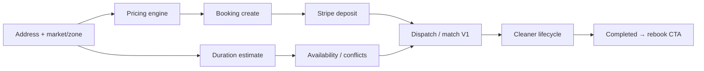

# Marketplace systems (architecture)

**Rule:** No secrets. Describes engines as designed/implemented — not a license to expand scope.  
**Gate:** Prove BOOK → PAY → ASSIGN → CLEAN → COMPLETE → REBOOK before V2 slot generation / auto-match.  
**Peers:** `docs/ALGORITHMS.md`, `docs/MATCHING.md`, `docs/MARKETPLACE.md`, `docs/MARKETPLACE_ROADMAP.md`

Statuses reflect **code readiness**, not local e2e proof (see `CURRENT_SPRINT.md`).

---

## System map

| Engine | MVP role | Module | Status |
|--------|----------|--------|--------|
| Service area / markets | Hard gate for paid book | `src/config/markets.ts`, `src/lib/markets/` | PASS (code) |
| Pricing | Server authority on quote + create | `src/lib/pricing/` | PASS (code + unit tests) |
| Duration | Job length for schedule / conflicts | `estimateDurationMinutes` in pricing config; `src/lib/availability/duration.ts` | PASS (code) |
| Availability | Conflict + window checks for assign | `src/lib/availability/` | PARTIAL (math live; full slot UX later) |
| Matching / dispatch | Rank + admin assign/offer | `src/lib/matching/` | PASS (code); needs supply |
| ETA | Soft factor / live map later | `src/lib/eta/` | PARTIAL (simple haversine) |
| Reliability / demand / fraud / batch | Later | stubs under `src/lib/{reliability,demand,fraud}/` etc. | MISSING / stub — do not claim live |

---

## 1. Pricing engine

**Purpose:** Single source of truth for customer totals and deposits. Client preview is non-authoritative.

**Authority path:**
1. Client may call `POST /api/bookings/quote` for display.
2. `POST /api/bookings` recalculates with `calculateBookingPrice` and `assertPriceMatch(clientTotalCents)`.
3. Checkout uses server booking amounts (deposit % from env/config).

**Inputs:** market (currency), service type, beds/baths/sqft, extras, quote-only vs instant.  
**Outputs:** `PriceBreakdown` (base, rooms, sqft, extras, fees, total, deposit).  
**Files:** `src/lib/pricing/calculateQuote.ts`, `config.ts`, `src/app/api/bookings/quote/route.ts`, `src/app/api/bookings/route.ts`  
**Rules:** No autonomous price changes from Revenue agents; no client-trusted totals.

---

## 2. Market / service-area engine

**Purpose:** Resolve address → market + zone; block paid booking outside service area.

**Behavior:** Postal/ZIP prefix first, then city/region; soft region match may set market with `inServiceArea: false` → `resolveMarketOrThrow` blocks pay path.  
**Config:** `src/config/markets.ts` (TORONTO_GTA, SOUTH_FLORIDA, NEW_YORK, CALIFORNIA in code; remote DB may have a subset of seed rows).  
**Files:** `src/lib/markets/eligibility.ts`, `docs/MARKETPLACE.md`

---

## 3. Duration engine

**Purpose:** Estimate job minutes from service + property + extras for scheduling buffers and availability conflicts.

**MVP:** `estimateDurationMinutes` in `src/lib/pricing/config.ts`; availability module consumes duration + travel buffer.  
**Not MVP:** Multi-stop route optimization (V4).

---

## 4. Availability engine

**Purpose:** Prevent double-booking; respect cleaner weekly windows when present.

**MVP slice:** Conflict check + window helpers used by dispatch/assign (`findScheduleConflict`, `checkAvailability`).  
**Later (roadmap P2):** Real customer-facing slot generation from supply (`suggestArrivalWindows` / capacity).  
**Files:** `src/lib/availability/{conflicts,windows,slots,duration,index}.ts`, cleaner CRUD in `src/lib/pro/dashboard/availability.ts`

---

## 5. Matching / dispatch engine (V1)

**Purpose:** Rank eligible cleaners for admin; support offer → accept → assigned.

**Pipeline:** Hard eligibility (active/approved, service, zone, availability) → score breakdown → ranked list → admin assign or offer.  
**Concurrency:** Optimistic locks / unique active assignment constraints (see `assignment.ts` header).  
**Statuses:** `awaiting_assignment` → `offered` / `assigned` / `accepted`.  
**Files:** `src/lib/matching/{assignment,rankCleaners,scoreCleaner,calculateMatchScore,eligibility,geo,config}.ts`  
**APIs:** `src/app/api/admin/bookings/[id]/{matches,offers}/route.ts`, assign via admin booking routes  
**V2+ (gated):** Auto-offer, automated matching — roadmap only until V1 trusted.

---

## 6. Cleaner job lifecycle

**Purpose:** Fulfillment ladder after assign.

**Transitions:** `on_the_way` → `arrived` → `in_progress` → `completed`  
**Files:** `src/lib/pro/job-transitions.ts`, `src/lib/pro/dashboard/jobs.ts`, `src/app/api/pro/jobs/[id]/route.ts`  
**Live location:** Allowed in `on_the_way` / `arrived` (`LIVE_LOCATION_STATUSES`); table `cleaner_live_locations` on remote.

---

## 7. Payments + idempotency (transaction integrity)

| Concern | Mechanism |
|---------|-----------|
| Duplicate pending booking | Optional `idempotencyKey` on create + unique column reuse |
| Duplicate PaymentIntent | Reuse open PI; Stripe idempotency key `maidlinx_checkout_{id}_{deposit}` |
| Duplicate webhook side effects | Claim `stripe_webhook_events.id` before confirm |
| Already paid | Checkout rejects if PI/`payment_status` already succeeded |

**Files:** `src/lib/bookings/repository.ts`, `src/app/api/bookings/[id]/checkout/route.ts`, `src/lib/payments/webhook-events.ts`, `src/app/api/webhooks/stripe/route.ts`

---

## Dependency on env / supply

| Engine | Needs to prove e2e |
|--------|--------------------|
| Pricing | Runnable unit tests without secrets |
| Booking persist | `SUPABASE_SERVICE_ROLE_KEY` |
| Pay | Stripe TEST keys + webhook secret |
| Dispatch / lifecycle | ≥1 approved cleaner + paid booking |
| Places UX | Maps key + Google Cloud billing (manual address fallback exists) |

---

## Do not implement while MVP gate open

- Auto-dispatch as default
- Demand incentives / fraud product gates as live claims
- Multi-job schedule optimizer
- Commercial quoting as parallel booking system
- Changing deposit % or payout rates without Product + human approval
