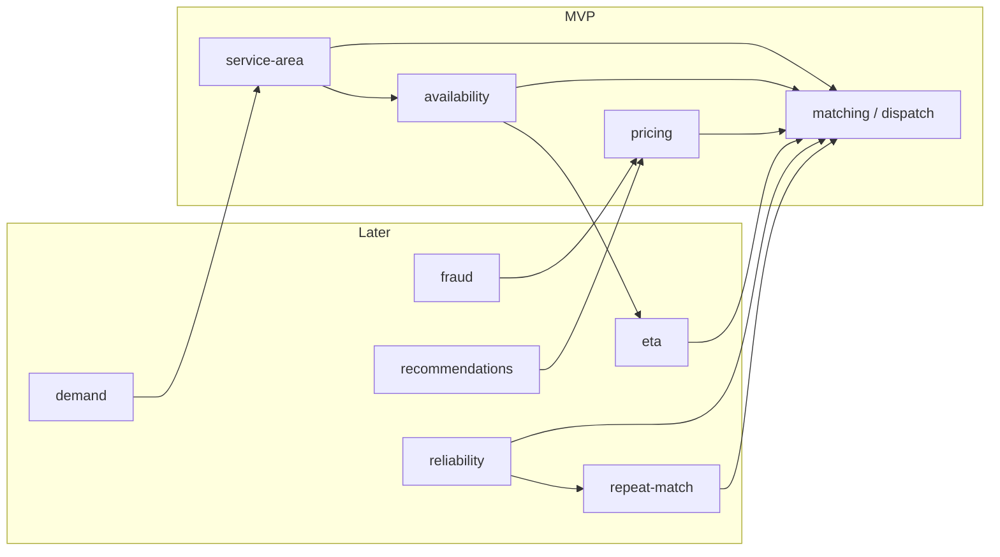

# MaidLinx Algorithm Systems Architecture

Long-term map of marketplace algorithms. Product phases: [`MARKETPLACE_ROADMAP.md`](./MARKETPLACE_ROADMAP.md).

**Live today:** pricing, matching (admin dispatch), availability conflicts, simple haversine ETA, funnel analytics hooks.  
**Stubs:** demand/incentives, fraud, recommendations, batch multi-job optimizer, full reliability composite.

Do **not** invent fake scoring logic in stubs. Implement against the contracts below when a system becomes MVP-critical.

> Closest ≠ quickest — Travel Fit weights ETA over raw distance.

## System map

| # | System | Module | Phase |
|---|--------|--------|-------|
| 1 | Dispatch / match score | [`src/lib/matching/`](../src/lib/matching/) | **MVP** |
| 2 | Availability | [`src/lib/availability/`](../src/lib/availability/) | **MVP** |
| 3 | ETA | [`src/lib/eta/`](../src/lib/eta/) | Later |
| 4 | Pricing | [`src/lib/pricing/`](../src/lib/pricing/) | **MVP** (exists) |
| 5 | Cleaner reliability | [`src/lib/reliability/`](../src/lib/reliability/) | Later |
| 6 | Repeat-match | [`src/lib/repeat-match/`](../src/lib/repeat-match/) | Later |
| 7 | Service area | [`src/lib/service-area/`](../src/lib/service-area/) | **MVP** (basics) |
| 8 | Demand forecasting | [`src/lib/demand/`](../src/lib/demand/) | Later |
| 9 | Fraud / risk | [`src/lib/fraud/`](../src/lib/fraud/) | Later |
| 10 | Recommendations | [`src/lib/recommendations/`](../src/lib/recommendations/) | Later |

Related product scope: [`MVP.md`](../MVP.md) (Phase roadmap).

---

## 1. Dispatch algorithm (best cleaner)

**Purpose:** Rank eligible cleaners for a booking so admin (MVP) or auto-assign (later) can pick the best fit.

**Module:** `src/lib/matching/` — **Dispatch algorithm v1** is the match-score engine (`computeMatchScore` in `score.ts`; ranking via `rank.ts` when present). Types/weights: `types.ts`, `config.ts`; geo helpers: `geo.ts`. See that module’s README for the live factor table.

**Inputs (conceptual):**
- Booking: location, schedule/window, service type, requirements, payout/value
- Cleaner candidates: location/service area, availability, qualifications, rating, completion/cancel rates
- Context: distance, ETA estimate, repeat preference, hard eligibility gates

**Outputs:**
- Per-cleaner score `0–100` with factor breakdown
- Ranked list for admin assignment UI

**Dependencies:**
- **Hard gates (MVP):** service-area, availability (no double-book), active/verified cleaner
- **Soft factors (v1+):** rating, reliability proxies, ETA, repeat preference, job value
- Consumes later modules as they mature (does not require them to ship v1)

**MVP vs later:**
- **MVP:** Score + rank in **admin assignment only**; manual assign remains source of truth. Auto-matching stays out of scope (see MVP.md).
- **Later:** Auto-dispatch, marketplace offers, A/B weights, learning-to-rank.

---

## 2. Availability algorithm

**Purpose:** Prevent double-booking and ensure a cleaner can cover travel + job duration for a requested window.

**Module:** `src/lib/availability/` (algorithm). Cleaner UI prefs today live in `src/lib/pro/dashboard/availability.ts` — keep that as the preference store; this module owns conflict math.

**Inputs:**
- Proposed booking: start window, estimated duration (`pricing.estimateDurationMinutes` or successor)
- Cleaner’s existing jobs and declared weekly windows
- Travel buffer / max jobs per day (config)

**Outputs:**
- `isAvailable: boolean`
- Blocking reason (`overlap`, `outside_window`, `travel_conflict`, …)
- Optional free slots for a date range

**Dependencies:** bookings schedule, pricing duration estimate, (later) ETA/travel time, service-area.

**MVP vs later:**
- **MVP:** Overlap check + weekly window check before assign/accept.
- **Later:** Multi-stop routing, buffer optimization, real-time calendar sync.

---

## 3. ETA algorithm

**Purpose:** Predict cleaner arrival for customer messaging and dispatch ranking.

**Module:** `src/lib/eta/`

**Inputs:** cleaner last known / start location, job address, traffic/time-of-day, prior lateness, on-the-way timestamp.

**Outputs:** `etaAt` (ISO), confidence band, lateness risk flag.

**Dependencies:** addresses/geo, job status (`on_the_way`), (later) maps provider; feeds dispatch + reliability.

**MVP vs later:**
- **MVP:** Haversine `estimateTravelMinutes` for customer tracking + match travel factor.
- **Later:** Live ETA after “on the way”; traffic-aware Maps provider.

---

## 4. Pricing engine

**Purpose:** Quote a booking from size, service type, extras, and fees. Eventual inputs also include frequency, location, labor market, and availability pressure.

**Module:** `src/lib/pricing/` — **already implemented** for MVP quoting. Do not rewrite casually; extend carefully.

**Current MVP behavior:**
- Base by service type, bedrooms/bathrooms, sq ft tiers, extras, platform fee
- Duration estimate for scheduling hints
- Wired into booking APIs via `calculateBookingPrice` / `assertPriceMatch`

**Inputs (today):** service type, bedrooms, bathrooms, square footage, extras  
**Inputs (later):** frequency discounts, location/zone multipliers, labor cost, surge from demand/availability

**Outputs:** `PriceBreakdown` (`totalCents`, fee lines, optional `estimatedDurationMinutes`)

**Dependencies:** booking constants/catalog; later demand + service-area for geo/surge.

**MVP vs later:**
- **MVP:** Deterministic quote (current module). Keep booking/payment path stable.
- **Later:** Dynamic/location/frequency pricing; cleaner payout rules.

---

## 5. Cleaner reliability score

**Purpose:** Summarize operational trust: completions, lateness, cancellations, ratings, disputes.

**Module:** `src/lib/reliability/`

**Inputs:** completed jobs, on-time vs late arrivals, cleaner/customer cancels, review scores, dispute outcomes.

**Outputs:** reliability score + component metrics (for admin and dispatch factors).

**Dependencies:** bookings/status history, reviews, disputes (`src/lib/admin/disputes.ts`), ratings aggregates.

**MVP vs later:**
- **MVP:** Use raw `rating_average` / counts if needed in match score.
- **Later:** Dedicated reliability composite with decay and dispute weighting.

---

## 6. Repeat-match algorithm

**Purpose:** Prefer a customer’s liked / prior cleaners when they are eligible.

**Module:** `src/lib/repeat-match/`

**Inputs:** customer id, candidate cleaners, favorites (`customer_favorite_cleaners` / `src/lib/dashboard/favorites.ts`), prior completed pairings, ratings of those jobs.

**Outputs:** preference boost (or hard prefer-if-available flag) for dispatch.

**Dependencies:** favorites + booking history; typically applied inside matching, not as a separate assign path.

**MVP vs later:**
- **MVP:** Optional soft boost in match score if favorites data is available.
- **Later:** “Request same cleaner” UX, recurring series pinning.

---

## 7. Service-area algorithm

**Purpose:** Restrict and prioritize Toronto / South Florida (and future) zones so jobs only match cleaners who cover the address.

**Module:** `src/lib/service-area/` (algorithm). Admin CRUD today: `src/lib/admin/service-areas.ts` + `service_areas` table.

**Inputs:** address (lat/lng and/or postal code), cleaner home/radius or assigned zones, active area catalog.

**Outputs:** `inServiceArea`, matching zone id(s), distance-to-zone / coverage score.

**Dependencies:** `addresses`, `service_areas`, cleaner radius/zones.

**MVP vs later:**
- **MVP:** Postal/city allow-list gate + basic distance for dispatch.
- **Later:** Polygons, multi-metro expansion, demand-aware capacity by zone.

---

## 8. Demand forecasting

**Purpose:** Estimate cleaners needed by area and time to guide hiring, incentives, and (later) surge.

**Module:** `src/lib/demand/`

**Inputs:** historical bookings by zone/window, lead time, seasonality, cancellations, supply (active cleaners).

**Outputs:** forecasted job volume and supply gap per zone/time bucket.

**Dependencies:** service-area taxonomy, bookings history; informs pricing surge and ops tooling.

**MVP vs later:** Later only (ops dashboards / incentives). Stub exports:
`forecastDemand`, `suggestCleanerIncentive` — do not wire promotions UI.

---

## 9. Fraud / risk system

**Purpose:** Flag suspicious accounts, duplicate bookings, and payment abuse before or after checkout.

**Module:** `src/lib/fraud/`

**Inputs:** account signals (new email/phone/device), booking velocity, duplicate address/time patterns, payment/refund/dispute history, coupon abuse.

**Outputs:** risk score / decision (`allow`, `review`, `block`) with reasons for admin.

**Dependencies:** auth profiles, bookings, payments, coupons, disputes. Must not break legitimate checkout paths.

**MVP vs later:**
- **MVP:** Manual admin review; basic Stripe fraud tools only.
- **Later:** Rules engine + queue; optional soft blocks on high-risk deposits.

---

## 10. Recommendation engine

**Purpose:** Suggest recurring cadence and extras from customer history.

**Module:** `src/lib/recommendations/`

**Inputs:** past bookings (service type, extras, frequency), address, seasonal patterns.

**Outputs:** ranked suggestions (e.g. biweekly plan, oven clean) with confidence; never auto-charges.

**Dependencies:** booking history, pricing catalog; optional demand for timing hints.

**MVP vs later:** Later (post-recurring/subscriptions product work).

---

## Implementation order (when building next)

1. **Service-area basics** — eligibility gate  
2. **Availability conflicts** — no double-book + duration/travel buffer  
3. **Dispatch / matching v1** — admin ranked suggestions (in progress / adjacent work)  
4. **Pricing extensions** — only when product needs frequency/geo (keep current quote stable)  
5. Reliability → repeat-match deepening → ETA → fraud → demand → recommendations  

## Coordination notes

- **Matching:** Owned by Dispatch algorithm v1 (`src/lib/matching/`). Other systems expose types/helpers; matching consumes them. Do not fork a second score engine.
- **Pricing:** Production path — extend, don’t replace, without an explicit migration.
- **Booking/payment:** Algorithm stubs must not change Stripe deposit or status lifecycle behavior.
