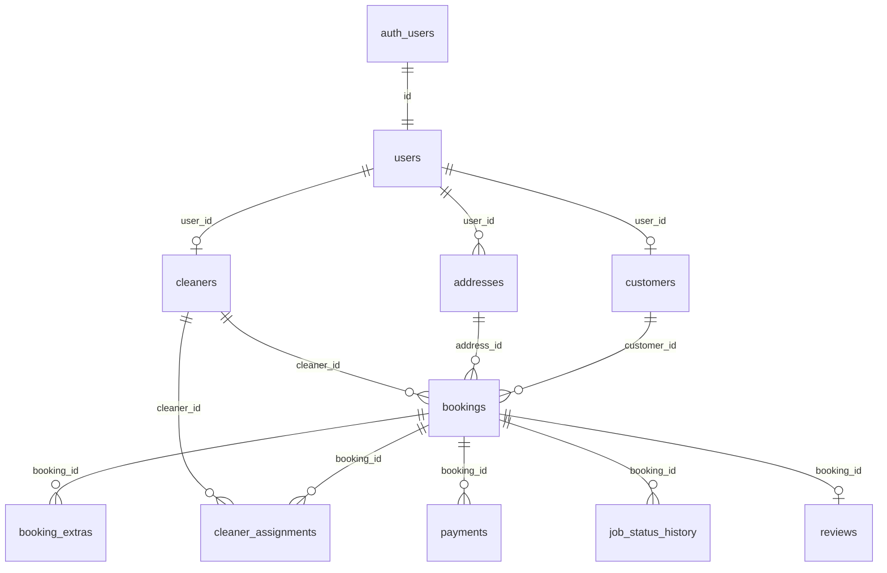

# Maidlinx MVP Database Schema

Ten core tables for the first functional release. Supabase Auth (`auth.users`) is the identity provider; `public.users` is the app profile row keyed by the same UUID.

## Entity relationship overview



## Tables

### `users`
Core app profile for every authenticated person (customer, cleaner, admin).

| Column | Notes |
|--------|-------|
| `id` | PK; matches `auth.users.id` |
| `email`, `first_name`, `last_name`, `phone` | Display & contact |
| `role` | `customer`, `cleaner`, `professional` (legacy), `admin` |
| `stripe_customer_id`, `stripe_connect_id` | Stripe IDs |
| `onboarding_complete` | Profile setup flag |

**Legacy:** `profiles` is a backward-compat **view** on `users`.

### `customers`
Customer-specific data, one row per user who books.

| Column | Notes |
|--------|-------|
| `user_id` | FK → `users.id` (unique) |
| `stripe_customer_id` | Canonical Stripe customer |
| `default_address_id` | FK → `addresses.id` |

Auto-created on signup via `handle_new_user()`.

### `cleaners`
Cleaner-specific profile and marketplace stats.

| Column | Notes |
|--------|-------|
| `user_id` | FK → `users.id` (unique) |
| `bio`, `years_experience`, `service_radius_km` | Profile |
| `is_verified`, `is_active` | Admin / availability gates |
| `rating_average`, `rating_count` | Aggregated from reviews |

**Legacy:** `professionals` is a backward-compat **view** on `cleaners` (`profile_id` → `user_id`).

### `addresses`
Saved service locations.

| Column | Notes |
|--------|-------|
| `user_id` | FK → `users.id` (canonical) |
| `profile_id` | Legacy alias; kept in sync via trigger |
| `line1`, `city`, `state`, `postal_code`, `country` | Address fields |
| `latitude`, `longitude` | Geocoding |
| `is_default` | Preferred address |

### `bookings`
A scheduled cleaning job.

| Column | Notes |
|--------|-------|
| `customer_id` | FK → `users.id` (nullable for guest checkout) |
| `cleaner_id` | FK → `cleaners.id` (assigned cleaner) |
| `professional_profile_id` | Legacy; cleaner's `users.id` |
| `address_id` | FK → `addresses.id` (optional) |
| `service_type`, `status`, `scheduled_at` | Job definition |
| `subtotal_cents`, `platform_fee_cents`, `total_cents` | Pricing |
| `extras` | Legacy jsonb array; use `booking_extras` for new writes |

### `booking_extras`
Line items for add-ons (oven, fridge, etc.).

| Column | Notes |
|--------|-------|
| `booking_id` | FK → `bookings.id` |
| `extra_key` | Catalog key |
| `unit_price_cents`, `quantity`, `total_cents` | Pricing |

### `payments`
Stripe payment records (deposit, balance, full, refund).

| Column | Notes |
|--------|-------|
| `booking_id` | FK → `bookings.id` |
| `user_id` / `profile_id` | Payer (synced via trigger) |
| `amount_cents`, `status`, `payment_type` | Amount & state |
| `stripe_payment_intent_id` | Stripe reference |

### `cleaner_assignments`
Explicit assignment history (self-accept or admin manual assign).

| Column | Notes |
|--------|-------|
| `booking_id` | FK → `bookings.id` |
| `cleaner_id` | FK → `cleaners.id` |
| `assigned_by` | FK → `users.id` (admin or self) |
| `source` | `self_accept` \| `admin_manual` |
| `status` | `pending`, `active`, `completed`, `cancelled`, `declined` |

### `job_status_history`
Audit trail of booking status transitions (auto-logged by trigger on `bookings.status` update).

| Column | Notes |
|--------|-------|
| `booking_id` | FK → `bookings.id` |
| `from_status`, `to_status` | Transition |
| `changed_by`, `note` | Optional actor & context |

### `reviews`
Post-job ratings (one per booking).

| Column | Notes |
|--------|-------|
| `booking_id` | FK → `bookings.id` (unique) |
| `reviewer_id`, `reviewee_id` | FK → `users.id` |
| `rating` (1–5), `comment` | Review content |

## `booking_status` enum (MVP)

Defined in `00008_booking_status_mvp.sql`:

```
pending_payment → confirmed → awaiting_assignment → assigned
  → on_the_way → arrived → in_progress → completed
cancelled (terminal)
```

| Old status | New status |
|------------|------------|
| `draft`, `pending` | `pending_payment` |
| `confirmed` (no cleaner) | `awaiting_assignment` |
| `confirmed` (with cleaner) | `assigned` |
| `on_the_way` | `on_the_way` |
| `refunded` | `cancelled` |

## Old → new name mapping

| Legacy | MVP | Strategy |
|--------|-----|----------|
| `profiles` | `users` | Table renamed; `profiles` view + INSTEAD OF triggers |
| — | `customers` | New table; backfilled from `users` |
| `professionals` | `cleaners` | Table renamed; `professionals` view |
| `addresses.profile_id` | `addresses.user_id` | Column added; bidirectional sync trigger |
| `bookings.extras` (jsonb) | `booking_extras` | Normalized rows; jsonb kept for compat |
| — | `cleaner_assignments` | New; backfilled from assigned bookings |
| `payments` | `payments` | Unchanged; `user_id` added |
| `job_status_history` | `job_status_history` | Unchanged (from `00006`) |
| `reviews` | `reviews` | Unchanged; RLS added |

## Applying migrations

Run in order:

1. `00007_mvp_table_alignment.sql` — table renames & new MVP tables
2. `00008_booking_status_mvp.sql` — booking status enum alignment
3. `00009_cleaner_portal_rls.sql` — cleaner portal RLS policies

```bash
# Local Supabase
supabase db reset          # or: supabase migration up

# Regenerate TypeScript types (optional; types are hand-maintained for now)
npm run db:types

# Remote Supabase
supabase db push
```

## Breaking changes

- **Direct DDL on `profiles` / `professionals`:** These are now views. DDL must target `users` / `cleaners`.
- **New required writes:** `booking_extras` on booking create; `cleaner_assignments` on assign/accept.
- **Canonical FK names:** Prefer `user_id` over `profile_id`, `cleaner_id` over `professional_profile_id` in new code.
- **Booking statuses:** Legacy values (`draft`, `pending`, `on_the_way`, `refunded`) are migrated to MVP enum values.

Existing app code querying `profiles` and `professionals` continues to work via compatibility views.

See [MVP.md](../MVP.md) for product flows.
